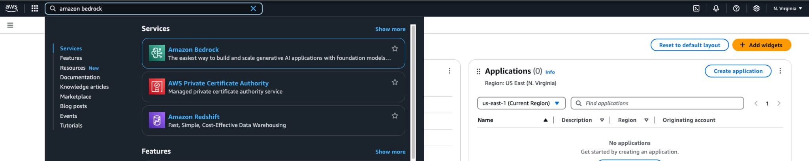
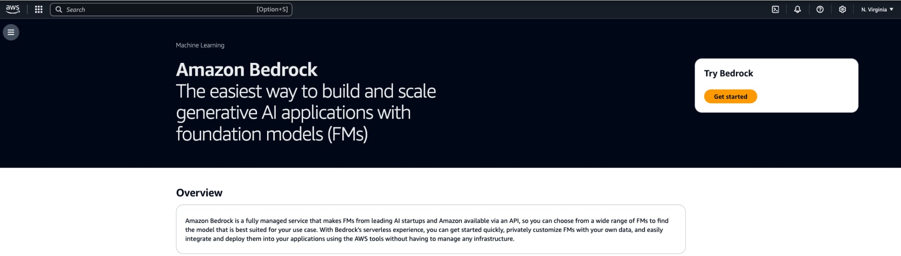
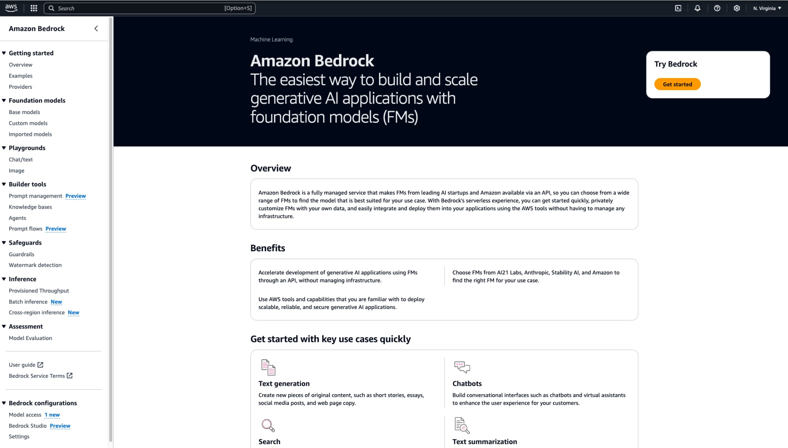
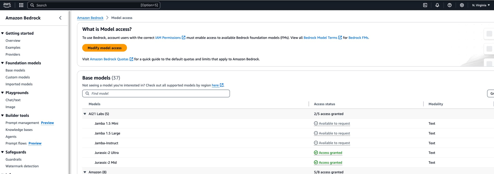
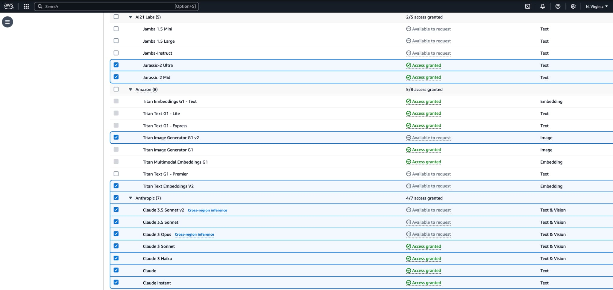
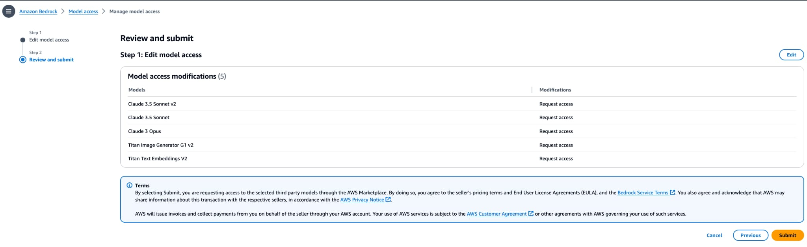
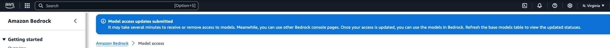

# Amazon Bedrock Setup Instructions

1. Search for **Amazon Bedrock** in the AWS console search bar at the top and select it.

2. Expand the side menu by clicking it.

3. From the side menu, select **Model Access** under **Bedrock Configuration** at the bottom.

4. You’ll now see the models you already have access to and those you don’t. Select the **Enable Specific Model**s or **Modify Model Access** button.

5. Select the checkboxes to activate the models. In the image below, you can see I have selected models from A21 Labs, Amazon, and Anthropic. Once selected, click the **Next** button at the bottom of the page.

6. Review the selected models or updated information on the **Review and Submit** page, then click the **Submit** button.

7. Once submitted successfully, you’ll see the following banner. It may take a few minutes for the models to move from * *In Progress to Access Granted* * status. You can use the **Refresh** button periodically to check for updates and verify that the model access status is * *Access Granted* * for the selected models.
